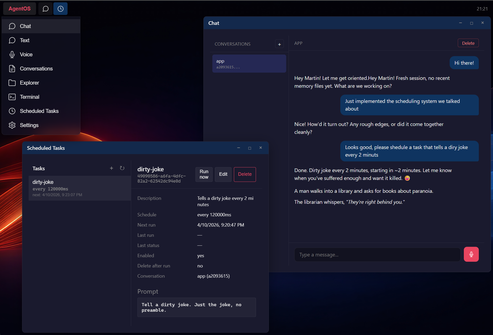

# OpenAgent

Multi-channel AI agent platform. Connects LLM providers to inbound channels with a shared agent personality, persistent conversations, and an extensible skill system.

**One agent, any channel, any LLM.** Build an AI agent once — reach it via REST API, WebSocket, Telegram, or WhatsApp. Switch LLM providers per conversation without losing context. Teach it new workflows by dropping a skill folder. Schedule autonomous tasks. Manage everything from a desktop-style web UI.



## Features

### Channels
Connect once, reach everywhere. Each channel gets its own conversation with full history and tool access.

- **REST API** — synchronous text completion with streaming events
- **WebSocket** — bidirectional text chat and real-time voice streaming
- **Telegram** — polling or webhook mode with streaming draft messages so users see responses as they form
- **WhatsApp** — Baileys-based bridge with QR pairing, automatic reconnection, and exponential backoff

### LLM Providers
Swap providers and models at runtime. No restarts, no redeployment. Per-conversation provider selection.

- **Azure OpenAI** — Chat Completions for text, Realtime API for voice
- **Anthropic Claude** — Messages API with adaptive thinking for Claude 4.6 models
- **Pluggable** — add new providers by implementing `ILlmTextProvider` or `ILlmVoiceProvider`

### Agent Skills
Open [agentskills.io](https://agentskills.io) format — compatible with Claude Code, Cursor, VS Code Copilot, and 30+ other AI clients.

Drop a `SKILL.md` folder into the skills directory and the agent learns new workflows. Skills are discovered at startup, listed in the system prompt, and activated per conversation when the task matches. Active skills persist across turns and survive conversation compaction.

### Tool System
Scoped to the data directory for safety. Tools are sent to the LLM via the wire protocol — not embedded in the system prompt.

- **File operations** — read, write, append, edit with line-level precision
- **Shell execution** — timeout enforcement, process tree cleanup, merged stdout/stderr
- **Web fetch** — URL validation, SSRF protection, content extraction
- **Skill resources** — load scripts, references, and assets from active skill directories

### Scheduled Tasks
Autonomous agent runs on a schedule. Cron expressions, fixed intervals, or one-shot execution.

- **Cron and interval triggers** — flexible scheduling with timezone support
- **Webhook triggers** — HTTP POST with context body injection for event-driven tasks
- **Delivery routing** — results delivered to channel conversations (Telegram, WhatsApp) or held for WebSocket pickup
- **On-demand execution** — trigger any task immediately via API

### Persistent Conversations
SQLite-backed with WAL mode. Conversations survive restarts, token usage is tracked, and long histories are automatically compacted via LLM-driven summarization. Tool call rounds are preserved across compaction boundaries.

### Personality Layer
System prompt composed from modular markdown files — SOUL.md, IDENTITY.md, USER.md, TOOLS.md, VOICE.md, MEMORY.md. Customize the agent's personality without touching code. Different conversation types (text, voice) get different prompt compositions.

### AgentOS Web Desktop
Desktop-style web UI built with React 19, TypeScript, and Vite.

- **Chat** — multi-conversation text and voice chat with streaming responses
- **Settings** — dynamic forms for provider configuration and channel connections, generated from backend schemas
- **File Explorer** — browse, view, and manage files in the data directory with format-specific viewers (markdown, JSON lines, plain text)
- **Terminal** — interactive PTY terminal via WebSocket with session persistence and tab eviction
- **Log Viewer** — query Serilog compact JSON logs with level filtering, time ranges, and full-text search

### Dynamic Configuration
Provider settings, channel connections, and skills are managed at runtime via admin API or the web UI. Hot-reload with no restarts.

## Architecture

```
Channels                    Core                         Providers
-----------                 ----                         ---------
REST API      --+                                +--  Azure OpenAI (Text)
WebSocket     --+                                +--  Anthropic Claude (Text)
Telegram      --+--  AgentLogic / Contracts  ----+--  Azure OpenAI (Voice)
WhatsApp      --+                                +--  (pluggable)

                         Skills Layer
                         ------------
                    {dataPath}/skills/*/SKILL.md
                    Catalog > Activate > System Prompt
```

- **Channels** receive inbound messages and deliver responses
- **AgentLogic** provides system prompt, tools, message history, and tool execution — it is injected context, not an orchestrator
- **Providers** call the LLM and drive the completion loop with a 10-round tool call safety cap
- **Skills** are markdown instruction documents that teach the agent specialized workflows

For a detailed technical reference covering all interfaces, data models, providers, endpoints, and design decisions, see [docs/architecture.md](docs/architecture.md).

## Tech Stack

- .NET 10, ASP.NET Core Minimal APIs, System.Text.Json
- Node.js 22 (Baileys bridge for WhatsApp Web protocol)
- React 19, TypeScript, Vite, CSS Modules
- SQLite with WAL mode and schema migration
- xUnit + WebApplicationFactory for integration tests
- Central Package Management (`Directory.Packages.props`)
- Docker container deployed to Azure App Service via GitHub Actions

## Getting Started

### Prerequisites

- [.NET 10 SDK](https://dotnet.microsoft.com/download)
- [Node.js 22+](https://nodejs.org/) (for web frontend and WhatsApp bridge)

### Build and Run

```bash
# Backend
cd src/agent
dotnet build
dotnet run --project OpenAgent

# Frontend
cd src/web
npm install
npm run dev
```

### Run Tests

```bash
cd src/agent
dotnet test
```

### Configuration

Provider configuration is managed at runtime via the admin API or the AgentOS settings UI. Authentication is via API key — set `Authentication__ApiKey` in environment variables or `appsettings.Development.json` for local development.

System prompt is composed from modular markdown files in the data directory: `AGENTS.md`, `SOUL.md`, `IDENTITY.md`, `USER.md`, `TOOLS.md`, `VOICE.md`, `MEMORY.md`.

### Skills

Drop a skill folder into `{dataPath}/skills/`:

```
skills/
  my-skill/
    SKILL.md          # YAML frontmatter + markdown instructions
    scripts/          # Optional executable code
    references/       # Optional documentation
```

Format follows the open [Agent Skills specification](https://agentskills.io/specification).

## Deployment

Docker image built via GitHub Actions on every push to master. Deployed to Azure App Service.

```bash
docker pull ghcr.io/mbundgaard/open-agent:latest
docker run -p 8080:8080 -v /data:/home/data ghcr.io/mbundgaard/open-agent:latest
```

## License

Proprietary.
