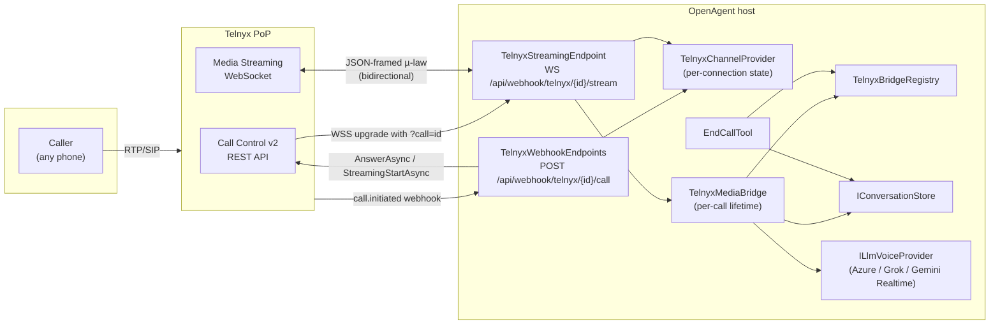
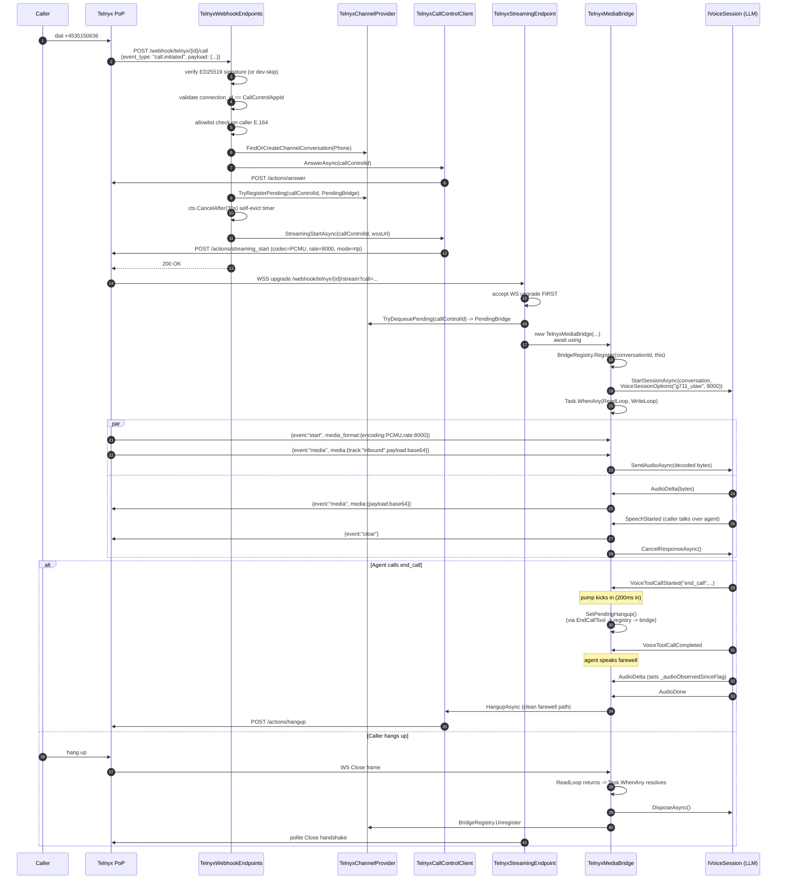
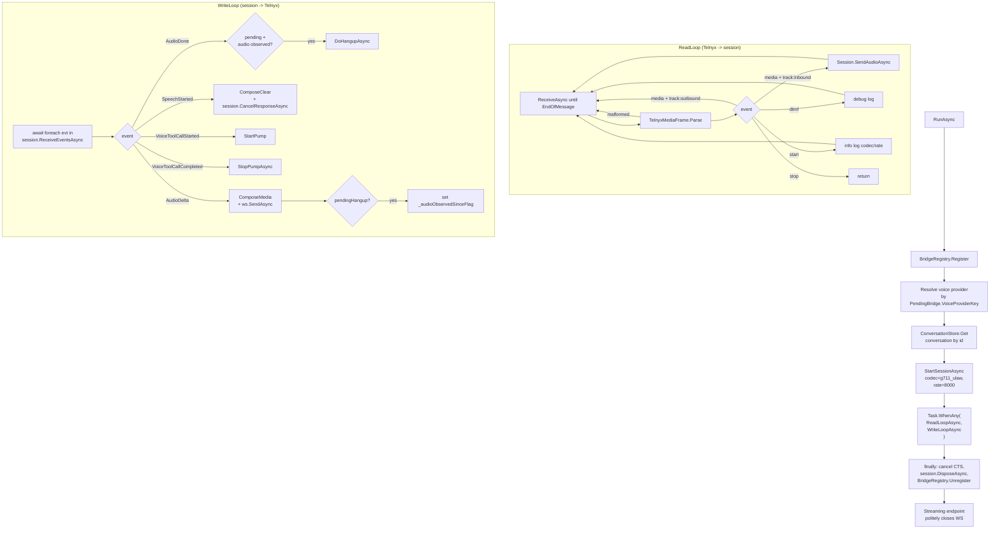
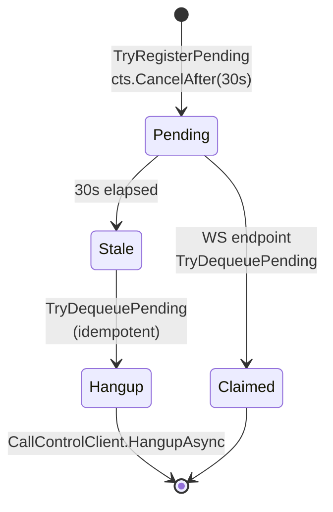
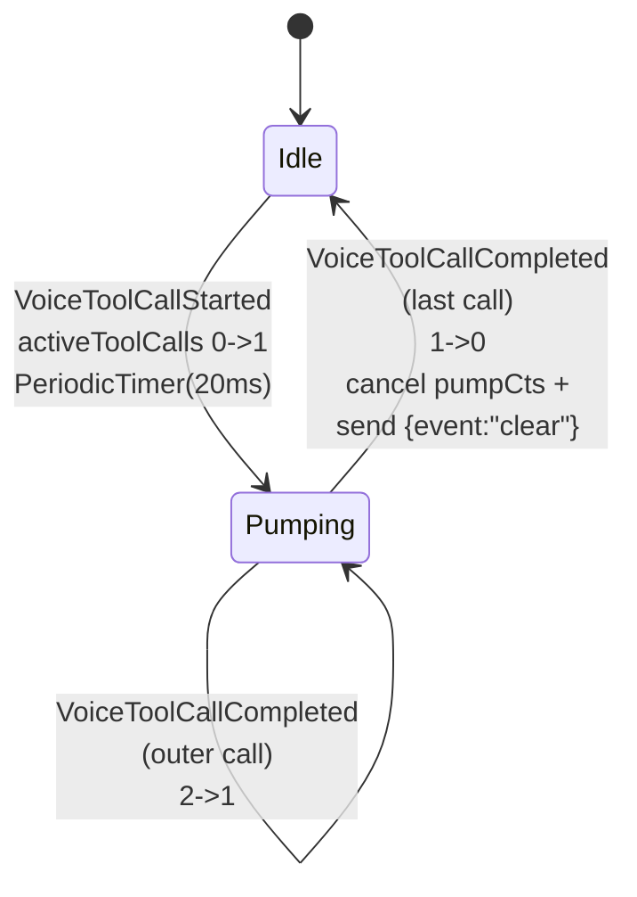
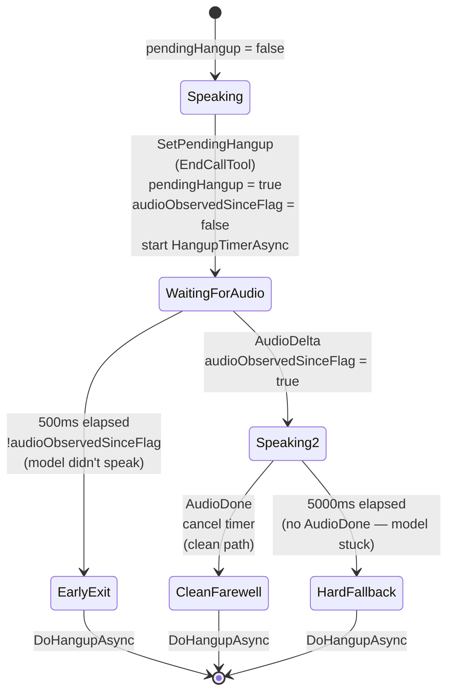
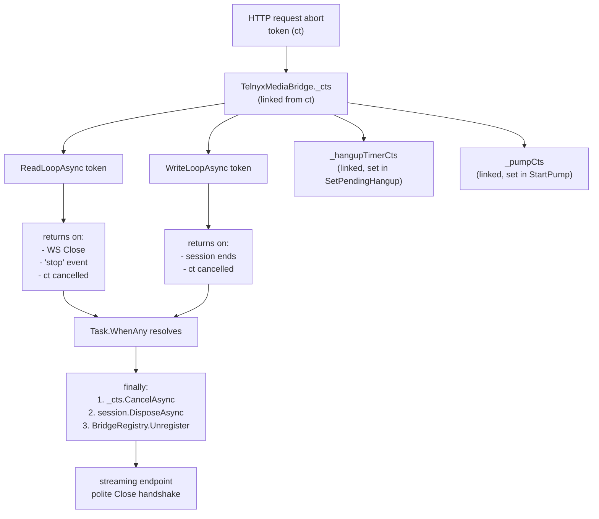
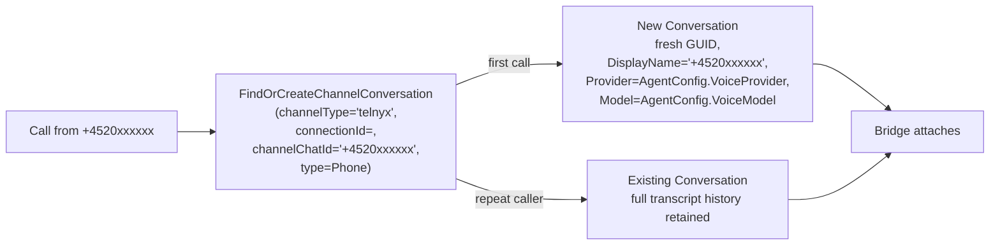

# Telnyx Real-time Voice Integration

> Walkthrough of the Telnyx phone integration delivered across PRs 1–3 on
> branches `feature/telnyx-realtime-voice`, `feature/telnyx-channel`, and
> `feature/telnyx-integration`.
> Use this as the entry point before reading the code.

---

## 1. Goal

Let a caller dial `+45 35 15 06 36`, hear an OpenAgent personality answer the phone within ~1s, hold a real-time bidirectional voice conversation, hear an ambient "thinking" loop while the agent runs tools, and have the agent be able to politely end the call itself. All audio flows as raw bytes — Telnyx delivers µ-law/8kHz frames over WebSocket; we plug them straight into a realtime LLM voice session and pipe the LLM's audio back the same way.

The integration is built on **Telnyx Media Streaming** (`stream_bidirectional_mode = "rtp"`), not TeXML. That means OpenAgent owns STT/TTS via the LLM provider — Telnyx is just the SIP/PSTN <-> WebSocket pipe.

---

## 2. High-level architecture



Two HTTP/WebSocket entry points share the same `webhookId` so multiple Telnyx connections can coexist behind one host:

| Direction              | Path                                              | Transport | Auth                                     |
| ---------------------- | ------------------------------------------------- | --------- | ---------------------------------------- |
| Lifecycle webhook (in) | `POST /api/webhook/telnyx/{webhookId}/call`       | HTTPS     | `.AllowAnonymous()` + ED25519 signature  |
| Media stream (in/out)  | `WSS  /api/webhook/telnyx/{webhookId}/stream?call=...` | WebSocket | `.AllowAnonymous()` + pending-bridge dequeue |

`webhookId` is auto-generated on first start and persisted to `connections.json`, so the user can paste a stable URL into the Telnyx Developer Hub once.

---

## 3. Component map

All new code lives under `src/agent/OpenAgent.Channel.Telnyx/` unless noted.

| Component                          | File                                      | Role                                                                                |
| ---------------------------------- | ----------------------------------------- | ----------------------------------------------------------------------------------- |
| `TelnyxOptions`                    | `TelnyxOptions.cs`                        | Strongly-typed connection config (apiKey, baseUrl, callControlAppId, etc.)          |
| `TelnyxSignatureVerifier`          | `TelnyxSignatureVerifier.cs`              | ED25519 webhook auth, 300s replay window, dev-skip when no key                      |
| `TelnyxMediaFrame`                 | `TelnyxMediaFrame.cs`                     | Wire-level JSON envelope: parse `start`/`media`/`stop`/`dtmf`, compose `media`/`clear` |
| `TelnyxCallControlClient`          | `TelnyxCallControlClient.cs`              | REST client: `AnswerAsync`, `StreamingStartAsync`, idempotent `HangupAsync` (404/410 = OK) |
| `ThinkingClipFactory`              | `ThinkingClipFactory.cs`                  | Procedural µ-law clip — 4 sines, 50ms cosine-fade seam, deterministic, license-free |
| `TelnyxBridgeRegistry`             | `TelnyxBridgeRegistry.cs`                 | App-lifetime `ConcurrentDictionary<conversationId, ITelnyxBridge>`                  |
| `TelnyxOptions` parser + `TelnyxChannelProviderFactory` | `TelnyxChannelProviderFactory.cs` | Builds providers from `Connection.Config` blob; surfaces `ConfigFields` to the settings UI |
| `TelnyxChannelProvider`            | `TelnyxChannelProvider.cs`                | Per-connection runtime state; owns Call Control client, signature verifier, thinking clip, pending-bridge dictionary |
| `TelnyxWebhookEndpoints`           | `TelnyxWebhookEndpoints.cs`               | Lifecycle event router (`call.initiated` / `call.hangup` / `streaming.*`)           |
| `TelnyxStreamingEndpoint`          | `TelnyxStreamingEndpoint.cs`              | Accepts the Telnyx Media Streaming WS, claims a pending bridge, hands off to the bridge |
| `ITelnyxBridge`                    | `ITelnyxBridge.cs`                        | Single-method interface (`SetPendingHangup`) so `EndCallTool` doesn't take a hard dependency on `TelnyxMediaBridge` |
| `TelnyxMediaBridge`                | `TelnyxMediaBridge.cs`                    | Per-call byte pipe: read loop, write loop, barge-in, thinking pump, hangup state machine |
| `EndCallTool`                      | `EndCallTool.cs`                          | Agent tool; sets `pendingHangup` on the bridge for a Phone-type conversation        |
| `TelnyxToolHandler`                | `TelnyxToolHandler.cs`                    | `IToolHandler` exposing `EndCallTool` to `AgentLogic`                               |
| `PendingBridge`                    | (record at end of `TelnyxChannelProvider.cs`) | Holds `(callControlId, conversationId, voiceProviderKey, cts)` between webhook and WS connect |

Test fakes:

| Fake                | File                                        | Used by                                  |
| ------------------- | ------------------------------------------- | ---------------------------------------- |
| `FakeVoiceSession`  | `OpenAgent.Tests/Fakes/FakeVoiceSession.cs` | All bridge tests; collects audio in/out, exposes `Emit(VoiceEvent)` |

---

## 4. Call lifecycle — sequence diagram



### Webhook flow detail

```mermaid
flowchart TD
    A[POST /api/webhook/telnyx/{webhookId}/call] --> B{provider for<br/>webhookId?}
    B -- no --> X1[404]
    B -- yes --> C[Buffer body to byte array]
    C --> D{ED25519 sig<br/>valid?<br/>(or no key set)}
    D -- no --> X2[401]
    D -- yes --> E[Parse JSON envelope]
    E -- malformed --> X3[400]
    E -- ok --> F{connection_id ==<br/>CallControlAppId?}
    F -- no --> X4[401]
    F -- yes --> G{event_type}
    G -- call.initiated --> H[OnCallInitiated]
    G -- call.hangup --> I[OnCallHangup]
    G -- streaming.failed --> J[OnStreamingFailed]
    G -- "streaming.started/<br/>stopped/other" --> K[200 OK]

    H --> H1{caller in<br/>AllowedNumbers?<br/>(empty = allow-all)}
    H1 -- no --> H2[CallControlClient.HangupAsync] --> K
    H1 -- yes --> H3[FindOrCreateChannelConversation Phone]
    H3 --> H4[AnswerAsync]
    H4 --> H5[TryRegisterPending + 30s self-evict]
    H5 --> H6[StreamingStartAsync]
    H6 -- ok --> K
    H6 -- failed --> H7[Dequeue + HangupAsync] --> K

    I --> I1[Dequeue pending bridge if any] --> K
    J --> J1[Dequeue + HangupAsync] --> K
```

### Bridge state inside `RunAsync`



---

## 5. Audio format rule

Codec is per-channel, not per-provider. The bridge is a **byte pipe** — it does not resample.

| Channel               | Codec       | Sample rate | Negotiated by                                 |
| --------------------- | ----------- | ----------- | --------------------------------------------- |
| Telnyx phone          | `g711_ulaw` | 8 kHz       | `TelnyxMediaBridge` passes `VoiceSessionOptions("g711_ulaw", 8000)` to `IVoiceSession.StartSessionAsync` |
| Browser voice (Voice) | `pcm16`     | 24 kHz      | Default — `VoiceSessionOptions` not provided  |
| Native app (future)   | `pcm16`     | 24 kHz      | Same as browser                               |

`VoiceSessionOptions` is enforced per provider:

```csharp
// AzureOpenAiVoiceSession
if (requested.SampleRate != RateForCodec(requested.Codec))
    throw new ArgumentException(...);

// GrokVoiceSession
if (requested.Codec is "g711_ulaw" or "g711_alaw" && requested.SampleRate != 8000)
    throw new ArgumentException(...);
if (requested.Codec is "pcm16" && requested.SampleRate is not (8000 or 16000 or 24000))
    throw new ArgumentException(...);

// GeminiLiveVoiceProvider — only supports pcm16 16kHz today
if (options is not null && (options.Codec != "pcm16" || options.SampleRate != 16000))
    throw new ArgumentException(...);
```

`SessionReady` event is emitted to the client (browser or Telnyx bridge) so it can configure its `AudioContext` to match.

---

## 6. State machines

### 6.1 Pending-bridge timeout (lives in webhook handler)

When `call.initiated` is processed we register a `PendingBridge` keyed by `callControlId`. The bridge is *claimed* when Telnyx connects the streaming WebSocket. If that never happens (network blip, Telnyx queue stall), the call would leak.



### 6.2 Thinking pump

Started by `VoiceToolCallStarted`, stopped by `VoiceToolCallCompleted`. Reference-counted so nested tool calls keep the pump alive. Loops the procedural µ-law clip in 20ms / 160-byte slices via `PeriodicTimer`.



### 6.3 Agent-initiated hangup

Triggered by `EndCallTool`. The bridge has to wait for the agent's farewell audio to finish before actually hanging up — but mustn't wait forever if the LLM stalls. Three branches, all converge on idempotent `DoHangupAsync`:



`DoHangupAsync` is idempotent: it gates on `_pendingHangup` (set false on first entry), so concurrent timer-fire and AudioDone paths can race without double-hanging-up. The actual REST call uses `default` `CancellationToken` — best-effort, since by definition we're tearing down anyway.

---

## 7. Wire protocols

### 7.1 Lifecycle webhook payload

Telnyx posts JSON. We bind only the fields we need:

```json
{
  "data": {
    "event_type": "call.initiated",
    "payload": {
      "call_control_id": "v3:abc...",
      "connection_id": "2937009616636086168",
      "from": "+4520xxxxxx",
      "to":   "+4535150636"
    }
  }
}
```

`TelnyxWebhookEnvelope` / `TelnyxData` / `TelnyxPayload` use `[JsonPropertyName("snake_case")]` on every property. Snake-case naming policy alone is insufficient because the C# property names are PascalCase and `Deserialize<T>(byte[])` defaults to case-sensitive.

### 7.2 Media Streaming frames

Inbound (Telnyx → us):

```json
{"event":"start", "sequence_number":"1",
 "start":{"call_control_id":"v3:abc...",
          "client_state":"<base64>",
          "media_format":{"encoding":"PCMU","sample_rate":8000,"channels":1}},
 "stream_id":"s1"}

{"event":"media", "sequence_number":"4",
 "media":{"track":"inbound","chunk":"2","timestamp":"123",
          "payload":"<base64-µ-law>"}}

{"event":"stop", "stop":{"reason":"hangup"}}
{"event":"dtmf", "dtmf":{"digit":"5"}}
```

Outbound (us → Telnyx):

```json
{"event":"media", "media":{"payload":"<base64-µ-law>"}}
{"event":"clear"}
```

`TelnyxMediaFrame.ComposeMedia(ReadOnlySpan<byte>)` produces the outbound media frame; `ComposeClear()` returns the literal `{"event":"clear"}`.

### 7.3 Webhook signature (`TelnyxSignatureVerifier`)

- Header `Telnyx-Signature-ed25519` carries base64-encoded ED25519 signature of `UTF8(timestamp) + '|' + rawBody`.
- Header `Telnyx-Timestamp` carries unix seconds. ±300s anti-replay window.
- PEM-encoded public key from the Telnyx Developer Hub goes into `TelnyxOptions.WebhookPublicKey`.
- **Dev-skip**: when `WebhookPublicKey` is null/empty, verification logs a warning and returns `true`. Production must set the key.

```mermaid
flowchart TD
    A[Verify call] --> B{publicKeyPem<br/>null/empty?}
    B -- yes --> C[warn + return true<br/>'dev mode']
    B -- whitespace --> D[warn + return false]
    B -- valid --> E{sig + ts<br/>headers present?}
    E -- no --> F[warn + return false]
    E -- yes --> G{ts integer?}
    G -- no --> F
    G -- yes --> H{|now - ts|<br/>≤ 300s?}
    H -- no --> F
    H -- yes --> I{sig base64?}
    I -- no --> F
    I -- yes --> J[parse PEM]
    J -- malformed --> F
    J -- ok --> K[Ed25519 verify<br/>UTF8(ts) + '|' + body]
    K --> L{result}
```

### 7.4 Streaming URL

```
wss://{publicHost}/api/webhook/telnyx/{webhookId}/stream?call={URL-encoded callControlId}
```

Built by `TelnyxWebhookEndpoints.BuildStreamUrl(...)` from `TelnyxOptions.BaseUrl` (https → wss, http → ws). The webhook handler passes this URL to Telnyx's `StreamingStartAsync` along with `client_state = base64(UTF8(callControlId))`.

---

## 8. Threading model & cancellation



Key invariants:

- `_cts` is the one cancellation source the bridge owns. Cancelling it tears down both loops, the hangup timer, and the pump — in that one operation.
- `_session.DisposeAsync()` runs **after** `_cts.CancelAsync` so `ReceiveEventsAsync` unblocks cleanly.
- `BridgeRegistry.Unregister` always runs in `finally` so `EndCallTool` can never poke a dead bridge.
- The pump and hangup-timer tasks are fire-and-forget (`_ = Task.Run(...)` and `_ = HangupTimerAsync(...)`). They terminate via cancellation, not via `await`.
- The bridge is `IAsyncDisposable`; the streaming endpoint uses `await using var bridge`. `DisposeAsync` only releases `_cts` — the heavy cleanup runs in `RunAsync.finally` (which always completes before the using-scope exits because `RunAsync` is awaited).

---

## 9. Conversation lifecycle

A Telnyx connection has no fixed `Conversation.ConversationId` — each unique caller E.164 gets its own conversation, derived at runtime from `(channelType="telnyx", connectionId, channelChatId=fromE164)`.



Repeat callers get full transcript replay automatically — the LLM session is started against the existing `Conversation`, which means compaction summaries and prior messages are already in place.

The unused `Connection.ConversationId` field is set to a placeholder string `"unused"` for Telnyx connections — the `Connection` model requires it but the value is ignored.

---

## 10. Configuration surface

### 10.1 `TelnyxOptions` (stored in `connections.json`)

| Key                | Type                | Required | Notes                                                                |
| ------------------ | ------------------- | -------- | -------------------------------------------------------------------- |
| `apiKey`           | secret              | yes      | Telnyx v2 API key, used as `Authorization: Bearer`                   |
| `phoneNumber`      | string E.164        | yes      | Cosmetic; routing is on Telnyx side                                  |
| `baseUrl`          | https URL           | yes      | Public host the webhook + streaming URLs derive from                 |
| `callControlAppId` | string              | yes      | Telnyx Call Control connection ID (validates incoming `connection_id`)|
| `webhookPublicKey` | PEM                 | no       | ED25519 public key. Empty = dev-skip with warning                    |
| `allowedNumbers`   | string list / CSV   | no       | Empty list = allow all                                               |
| `thinkingClipPath` | path under dataPath | no       | Falls back to procedural default if missing or not a multiple of 160 bytes |
| `webhookId`        | 12-hex             | auto     | Generated on first start, persisted; URL stays stable across restarts |

The settings UI auto-renders from `TelnyxChannelProviderFactory.ConfigFields` — same dynamic-form pattern as Telegram and WhatsApp.

### 10.2 DI registrations (in `OpenAgent/Program.cs`)

```csharp
builder.Services.AddHttpClient();                                  // first IHttpClientFactory consumer
builder.Services.AddSingleton<TelnyxBridgeRegistry>();
builder.Services.AddSingleton<IChannelProviderFactory>(sp =>
    new TelnyxChannelProviderFactory(...));                        // alongside Telegram, WhatsApp
builder.Services.AddSingleton<EndCallTool>();
builder.Services.AddSingleton<IToolHandler, TelnyxToolHandler>();  // alongside FileSystem, Shell, etc.
// ...
app.MapTelnyxWebhookEndpoints();
app.MapTelnyxStreamingEndpoint();
```

`Func<string, ILlmVoiceProvider>` and `AgentEnvironment` are pre-existing — Telnyx reuses them.

---

## 11. Testing

| Test file                                | Coverage                                                                |
| ---------------------------------------- | ----------------------------------------------------------------------- |
| `TelnyxSignatureVerifierTests.cs`        | 5 cases: valid sig, no key (dev-skip), expired ts, tampered body, malformed PEM |
| `TelnyxMediaFrameTests.cs`               | 7 cases: parse start/media-inbound/media-outbound/stop/dtmf, compose media/clear |
| `TelnyxCallControlClientTests.cs`        | 4 cases: answer URL+auth, streaming_start body shape, hangup 404 = OK, hangup 500 throws |
| `ThinkingClipFactoryTests.cs`            | 2 cases: 16000-byte clip, fade boundary quieter than mid-clip mean      |
| `TelnyxBridgeRegistryTests.cs`           | 3 cases: register/get/unregister                                        |
| `TelnyxChannelProviderFactoryTests.cs`   | 3 cases: type metadata, config fields, options deserialization           |
| `TelnyxWebhookEndpointTests.cs`          | 2 integration cases: 404 unknown webhookId, 401 connection_id mismatch  |
| `TelnyxStreamingEndpointTests.cs`        | 1 integration case: unknown webhookId → WS Close frame                  |
| `TelnyxMediaBridgeTests.cs`              | 8 integration cases: inbound media decoded, outbound track filtered, dtmf no-crash, AudioDelta encoded, SpeechStarted clear+cancel, thinking pump frames flow, pump stops + clear, three hangup branches, caller-hangup teardown |
| `TelnyxEndCallToolTests.cs`              | 3 cases: phone-only gating, no-bridge error, active-bridge poked         |

Plus PR1 changes covered by `VoiceWebSocketTests.cs` (regressions) and `WebFetchToolCancellationTests.cs` / `ShellExecToolCancellationTests.cs` for the cancellation audit pinning.

**Test totals (full suite):** 385 passed, 0 failed, 3 skipped (Linux-only installer tests). 39 of those tests are Telnyx-specific.

The bridge tests use `WebApplicationFactory<Program>` with a `RecordingHandler` swapped into `IHttpClientFactory.CreateClient(nameof(TelnyxCallControlClient))` — Telnyx Call Control calls are captured, never sent to the real API. The `ILlmVoiceProvider` is replaced with a fake that returns `FakeVoiceSession`, allowing tests to push events into the bridge with `session.Emit(...)` and read frames off the WebSocket they connect themselves.

---

## 12. Changes to OpenAgent itself (outside the Telnyx project)

Several changes in PR1 were prerequisites — they're useful in their own right (e.g. cleaner provider contract) but were driven by Telnyx requirements.

| Change                                                  | File(s)                                                                 | Why                                                                 |
| ------------------------------------------------------- | ----------------------------------------------------------------------- | ------------------------------------------------------------------- |
| Added `VoiceSessionOptions(Codec, SampleRate)`          | `OpenAgent.Models/Voice/VoiceSessionOptions.cs`                         | Per-session codec for µ-law/8kHz on Telnyx, pcm16/24kHz elsewhere   |
| `ILlmVoiceProvider.StartSessionAsync` takes options     | `OpenAgent.Contracts/ILlmVoiceProvider.cs`                              | Single change point for codec selection                             |
| Azure / Grok / Gemini sessions honour options + validate | `AzureOpenAiVoiceSession.cs`, `GrokVoiceSession.cs`, `GeminiLiveVoiceProvider.cs` | Each provider knows its own valid (codec, rate) pairs               |
| Removed `Codec`/`SampleRate` from `GrokConfig` and `AzureRealtimeConfig` | (model files)                                                           | Codec is per-session now, not provider-level config                 |
| `VoiceToolCallStarted`/`VoiceToolCallCompleted` events  | `OpenAgent.Models/Voice/VoiceEvent.cs`                                  | Trigger thinking pump (Telnyx) and browser thinking-cue UI          |
| Try/finally + `TryWrite` of `VoiceToolCallCompleted`    | All three voice sessions                                                | Cancellation must never strand the thinking pump in "started" state |
| `VoiceThinkingStartedEvent`/`VoiceThinkingStoppedEvent` JSON | `OpenAgent.Models/Voice/VoiceWebSocketContracts.cs`                  | Browser-facing JSON variant of the same signal                      |
| Browser endpoint translates voice events to JSON cues   | `OpenAgent.Api/Endpoints/WebSocketVoiceEndpoints.cs`                    | Browser sees `{"type":"thinking_started"}` etc.                     |
| `ConversationType.Phone` enum value                     | `OpenAgent.Models/Conversations/Conversation.cs`                        | Distinct from Voice (browser) — drives system prompt selection      |
| `PHONE.md` defaults file + extraction                   | `OpenAgent/defaults/PHONE.md`, `SystemPromptBuilder.cs`                 | Phone-call etiquette prompt                                          |
| `services.AddHttpClient()` in `Program.cs`              | `OpenAgent/Program.cs`                                                  | Telnyx is the first `IHttpClientFactory` consumer in the codebase   |
| `BouncyCastle.Cryptography 2.4.0`                       | `Directory.Packages.props`                                              | ED25519 PEM parsing for webhook signature                            |

The voice contract change has nice side benefits — Grok's old `NormalizeCodec`/`ResolveRate` private helpers were removed, and codec is now driven from one place per session instead of being scattered across config defaults.

---

## 13. Plan deviations

The plan in `docs/superpowers/plans/2026-04-25-telnyx-realtime-voice.md` was a strong starting point but the codebase had moved since the plan was drafted. **17 corrections were applied during execution**, all back-ported to the plan so it remains a coherent reference. Listed roughly in execution order:

| # | Plan said... | Reality required... | Why |
| - | ------------ | ------------------- | --- |
| 1 | `IConversationStore.GetById(id)` | `IConversationStore.Get(id)` | Method name mismatch — `GetById` doesn't exist |
| 2 | `_agentConfig.DataPath` | `_environment.DataPath` (`AgentEnvironment`) | `AgentConfig` has no `DataPath`. WhatsApp uses the same `AgentEnvironment` injection |
| 3 | `new Connection { Id, Name, Type, Enabled, Config }` | Add `ConversationId = "unused"` | `Connection.ConversationId` is `required` but unused for Telnyx |
| 4 | `httpClientFactory: null!` in tests | `StubHttpClientFactory : IHttpClientFactory` returning `new HttpClient()` | Provider eagerly constructs Call Control client → NRE on null factory |
| 5 | `TestSetup.WithTelnyxConnection(_factory)` deconstructible | `SetupRunningConnectionAsync()` private helper | The plan invented a pattern that didn't exist; Telegram's pattern is simpler |
| 6 | `JsonSerializer.Deserialize<TelnyxWebhookEnvelope>(rawBody)` with no options on PascalCase classes | `[JsonPropertyName("snake_case")]` on every property | Without attrs, all fields parse to null |
| 7 | DI wiring all in plan Task 24 (last) | Telnyx factory + bridge registry + endpoint mapping folded into Task 16 | Integration tests boot the real DI graph; route must exist |
| 8 | Streaming endpoint sets `StatusCode = 404` and returns | Accept WS first, then `CloseAsync(NormalClosure, reason, ...)` for all errors | Status-code rejection makes `ConnectAsync` throw client-side; consistent close-frame is better WS protocol citizenship |
| 9 | Streaming endpoint omits `MapTelnyxStreamingEndpoint()` from `Program.cs` | Add explicit wiring step | Same trap as #7 — needed for integration tests |
| 10 | `TelnyxMediaBridge : IDisposable`, `using var bridge` | `IAsyncDisposable`, `await using var bridge` | Real bridge needs to await session disposal |
| 11 | Plan didn't cover server-driven WS exit | Polite close handshake after `RunAsync` returns | Without it, a session-ends-first exit leaves the client blocked waiting for a Close frame |
| 12 | Plan referenced `DuplexTestWebSocket` helper | Used `WebApplicationFactory` + real WebSocket round-trip | The helper didn't exist; integration tests reuse the existing voice WS pattern |
| 13 | `using System.Threading.Channels;` then `Channel.CreateUnbounded` | Fully qualified `System.Threading.Channels.Channel.CreateUnbounded` | `OpenAgent.Channel.*` namespaces shadow the unqualified token in test files |
| 14 | `AgentToolDefinition.Parameters = "..."` (string) | `Parameters = new { type = "object", properties = new {} }` | `Parameters` is `object`, not string — strings serialize as JSON strings, not schemas |
| 15 | `IToolHandler.Capability => "telnyx"` | Drop the property | The interface only has `Tools` |
| 16 | Reflection on registered `object` to invoke `SetPendingHangup` | Tiny `ITelnyxBridge` interface with a typed cast | Reflection is heavy and untestable; the interface is 5 lines |
| 17 | µ-law amplitude proxy `Math.Abs(b - 0x7F)` in fade test | `~b & 0x7F` | Standard ITU-T G.711 silence is at `0xFF`, not `0x7F`; the encoder ends in a bit-invert. The original proxy read silence as max amplitude |

These corrections were made up-front in 11 plan-edit commits before each implementer ran, so the plan and code stayed in lockstep:

```
67f75eb plan(telnyx): fix Task 13 µ-law amplitude proxy (silence is 0xFF, not 0x7F)
b0819c0 plan(telnyx): rename voice events in plan to match Task 6 reality
c090259 plan(telnyx): Task 15 corrections (AgentEnvironment, ConversationId, IHttpClientFactory)
e2fc8eb plan(telnyx): Task 16 corrections (DI wiring, JSON attrs, test pattern)
7ba5e21 plan(telnyx): Task 17 corrections (accept-then-close consistency, Program.cs wiring)
beb9ee7 plan(telnyx): Tasks 18+23 corrections (Get not GetById, Parameters object not string)
80baa0d plan(telnyx): Task 18 polite-close handshake + namespace gotcha
```

---

## 14. Things explicitly NOT done (deferred)

- **DTMF handling** — `dtmf` events are debug-logged only. The agent has no way to react to keypresses today.
- **G.722 / OPUS / AMR-WB / L16 codecs** — only PCMU/g711_ulaw is wired. Telnyx supports the others but we have no use case yet.
- **Outbound calls** — only inbound. There's no `CallControlClient.DialAsync`. Could be added without changing the bridge.
- **SIP-side metadata** (caller name, P-Asserted-Identity) — only E.164 is captured. Telnyx provides more in the webhook; not parsed.
- **Real-time transcript streaming to a UI** — transcripts persist as messages on the conversation but the OpenAgent UI doesn't currently watch a phone call live. The browser can replay the conversation post-call.
- **Multi-call concurrency** — supported by design (each call gets its own bridge with its own CTS) but not load-tested. The bridge registry uses `ConcurrentDictionary` so the data-structure side is fine.
- **Plan Task 26 (manual e2e)** — the user-driven phone-call test is documented in the plan but not yet run end-to-end against real Telnyx infrastructure.

---

## 15. Branch / PR layout

| Branch                              | Scope                                                                  | Status                                |
| ----------------------------------- | ---------------------------------------------------------------------- | ------------------------------------- |
| `feature/telnyx-realtime-voice`     | PR1 — voice contract + UI plumbing (Tasks 1–7)                         | Pushed; PR can open                   |
| `feature/telnyx-channel`            | PR2 — Telnyx primitives (Tasks 8–14)                                   | Pushed; PR can open after PR1 merges  |
| `feature/telnyx-integration`        | PR3 — full integration (Tasks 15–25)                                   | Local only; needs push                |

Each PR builds and tests cleanly on its own — the pre-verify pass before each task ensured no implementer ever produced a red branch.

---

## 16. Where to start reading

In suggested order:

1. **`docs/superpowers/specs/2026-04-25-telnyx-realtime-voice-design.md`** — the design spec (414 lines, 23 sections).
2. **`docs/superpowers/plans/2026-04-25-telnyx-realtime-voice.md`** — the task-by-task plan (now contains the 17 corrections inline).
3. **`src/agent/OpenAgent.Models/Voice/VoiceSessionOptions.cs`** — the small per-session codec record.
4. **`src/agent/OpenAgent.Channel.Telnyx/TelnyxOptions.cs`** — what config a Telnyx connection holds.
5. **`src/agent/OpenAgent.Channel.Telnyx/TelnyxChannelProvider.cs`** — per-connection runtime root.
6. **`src/agent/OpenAgent.Channel.Telnyx/TelnyxWebhookEndpoints.cs`** — call lifecycle handler.
7. **`src/agent/OpenAgent.Channel.Telnyx/TelnyxStreamingEndpoint.cs`** — WS upgrade + bridge handoff.
8. **`src/agent/OpenAgent.Channel.Telnyx/TelnyxMediaBridge.cs`** — heart of the integration.
9. **`src/agent/OpenAgent.Channel.Telnyx/EndCallTool.cs`** — agent-side hangup tool.
10. **`src/agent/OpenAgent.Tests/TelnyxMediaBridgeTests.cs`** — integration test harness, also a good showcase of how a phone call flows through the system.
